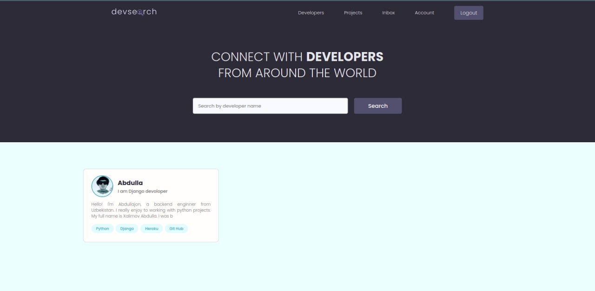

# DevSearch
Sourcode and Resources for UzDjango

See the full course here: https://devsearch-u.herokuapp.com

# Installation
* 1 - clone repo https://github.com/django-dev-uz/dev_search.git
* 2 - create a virtual environment and activate
*  - pip install virtualenv
*  - virtualenv envname
*  - envname\scripts\activate
* 3 - cd into project "cd uzdjango"
* 4 - pip install -r requirements.txt
* 5 - python manage.py loaddata fixture/products.json
* 6 - python manage.py runserver

# Features
* Share Projects
* Message other developers
* Rate others work
* Search other developers

# Tech Stack
* Django
* Postgres
* Django REST Framework

# Home Page

# Projects Page

# User Inbox
  

